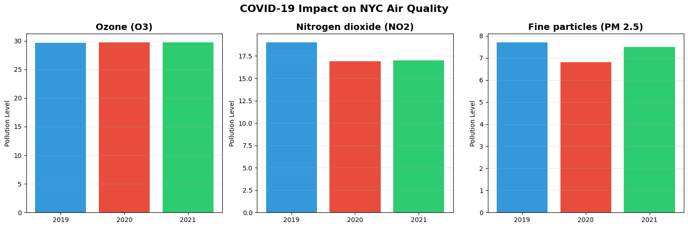

# NYC Air Quality Analysis (2008-2023)

🚧 **Work in Progress** - This project is actively being developed

## Project Overview
This project analyzes 15+ years of New York City air quality data to identify pollution trends, examine the COVID-19 pandemic's impact on air quality, and compare pollution levels across different neighborhoods.

## Key Findings

### 1. Long-Term Trends (2008-2023)

- **Nitrogen Dioxide (NO2)**: Decreased **47.1%** (28.29 → 14.96 ppb)
  - Major improvement driven by cleaner vehicles and stricter emissions regulations
- **Fine Particles (PM 2.5)**: Decreased **35.4%** (12.27 → 7.92 mcg/m³)
  - Significant air quality improvement from environmental policies
- **Ozone (O3)**: Increased **39.1%** (24.76 → 34.44 ppb)
  - Rising levels likely connected to climate change and warmer temperatures

### 2. COVID-19 Impact (2019-2021)

- **NO2 dropped 11%** during 2020 lockdown (reduced traffic and economic activity)
- **PM 2.5 dropped 11.8%** during 2020 lockdown (minimal construction and commuting)
- **Ozone remained stable** (complex atmospheric chemistry unaffected by reduced emissions)
- Pollution levels began returning toward pre-pandemic baselines in 2021 as NYC reopened

### 3. Neighborhood Disparities

**Cleanest Areas:**
- Rockaways and coastal neighborhoods benefit from ocean breezes that disperse pollutants
- Lowest NO2 and PM 2.5 levels in the city

**Most Polluted Areas:**
- Midtown Manhattan and Chelsea experience highest pollution from heavy traffic and urban density
- Up to 50% higher pollution levels compared to coastal areas

**Key Insight:** Geographic location and proximity to traffic corridors are major determinants of air quality exposure.

## Technologies Used
- **Python** (pandas, matplotlib) for data analysis and visualization
- **Google Colab** for development environment
- **Data Source**: NYC Open Data - Air Quality Dataset (18,000+ records)

## Dataset Details
- **Time Period**: 2008-2023 (15+ years)
- **Records**: 14,805 measurements across three main pollutants
- **Geographic Coverage**: All five NYC boroughs and 40+ neighborhoods

## What's Next
- [ ] Power BI dashboard for interactive visualizations
- [ ] Seasonal pattern analysis (Summer vs Winter)
- [ ] Time series forecasting for future trends
- [ ] Expanded neighborhood-level deep dive

## About This Project
This is an independent portfolio project demonstrating data cleaning, exploratory data analysis, statistical analysis, and data visualization skills. The project showcases my ability to transform raw data into actionable environmental insights.

**Created by Justin Martinez**  
Data Analytics Student, Syracuse University  
[LinkedIn](https://www.linkedin.com/in/justin-martinez556/) | [GitHub](https://github.com/justinmartinez4040)

---

*Last updated: January 2026*
